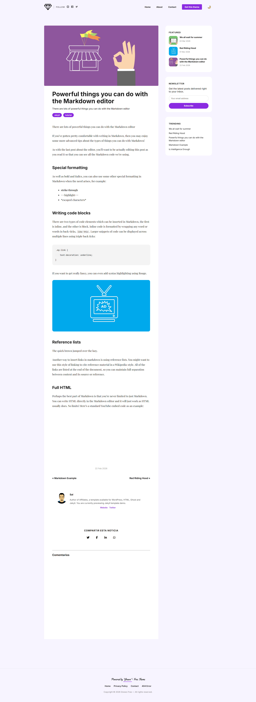

# 📰 Gnews Jekyll Theme (Free Version)

Gnews es un tema minimalista y rápido para blogs de noticias. Esta versión gratuita incluye el esquema de color **Purple** por defecto.

## ✨ Características
- Diseño responsive.
- Modo oscuro manual.
- Optimizado para SEO.
- Botones para compartir
- Manifest para PWA en movil Android y IOS
- Pagina de categorias y autor
- Provedores de Comentarios Integrado

## 💎 ¿Quieres más?
Obtén **Gnews Premium** para acceder a:
- 5 esquemas de colores (Cyan, Ruby, Coffee, Sunset, Emerald).
- Cambio dinámico de Temas en Comentarios.
- Espacios publicitarios optimizados.
- Busquedas en tiempo real.
- Mejor Respuesta en Articulos.
- Integaracion con ADS para publicidad.

## 👀👀 Capturas de la version
| Home (Skin Purple) | Vista de Artículo |
|:---:|:---:|
|  |  |
| *Vista principal del tema* | *Lectura optimizada y barra lateral* |

| Modo Oscuro | Versión Móvil |
|:---:|:---:|
|  |  |
| *Interfaz adaptativa en modo noche* | *Diseño responsive a una sola columna* |

## 🚀 Modo de uso

### 🛠️ Requisitos previos
- Tener instalado **Ruby** (versión 3.0 o superior).
- Tener instalado **Jekyll** y **Bundler**.

### 👍 Instalación del tema

1. **Clonar el repositorio:**
   ```bash
   git clone [https://github.com/tu-usuario/gnews-free.git](https://github.com/tu-usuario/gnews-free.git)
   cd gnews-free

Instalar dependencias:
Ejecuta el siguiente comando para instalar todas las gemas necesarias (incluyendo el motor de Jekyll):

Bash
bundle install
Configuración inicial:
Edita el archivo _config.yml con la información de tu sitio (título, descripción, url, etc.).

💻 Ejecución en local
Para ver el tema funcionando en tu computadora:
```
Bash
bundle exec jekyll serve
Luego abre tu navegador en http://localhost:4000.
```
📦 Compilación para producción (Despliegue)
Si vas a subir el sitio a un hosting que no sea GitHub Pages (como un servidor compartido), debes generar el sitio estático:

Bash
bundle exec jekyll build
Esto creará una carpeta llamada _site/ con todo el código HTML/CSS final. ¡Solo tienes que subir el contenido de esa carpeta a tu servidor!


---

### 2. ¿Cómo se "compila" técnicamente el tema?

Jekyll es un generador de sitios estáticos. El proceso de "compilación" sigue esta lógica:

1.  **Lectura:** Jekyll lee tus archivos `.md` (Markdown), `_layouts`, `_includes` y los datos del `_config.yml`.
2.  **Procesamiento (Liquid):** Sustituye todas las etiquetas `{{ }}` y `` por el contenido real.
3.  **Conversión:** Transforma el Markdown en HTML y el SASS en CSS plano.
4.  **Salida:** Todo se deposita en la carpeta `_site/`.

[Enlace a tu versión premium o tienda]

## 📄 Licencia
Este tema es de código abierto bajo la licencia MIT.